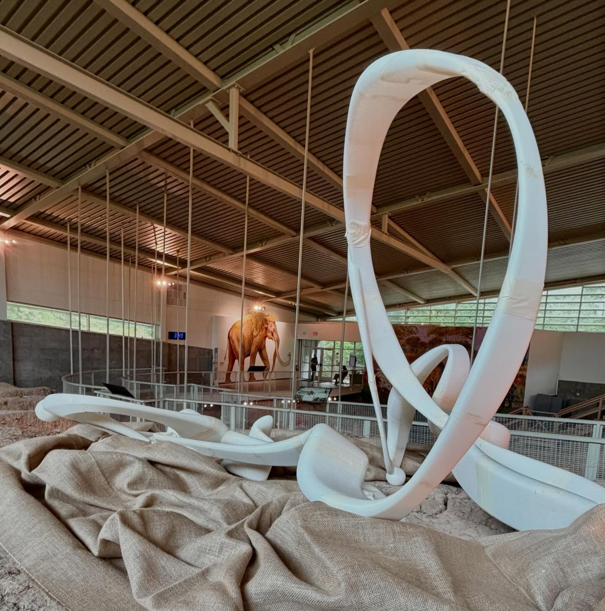
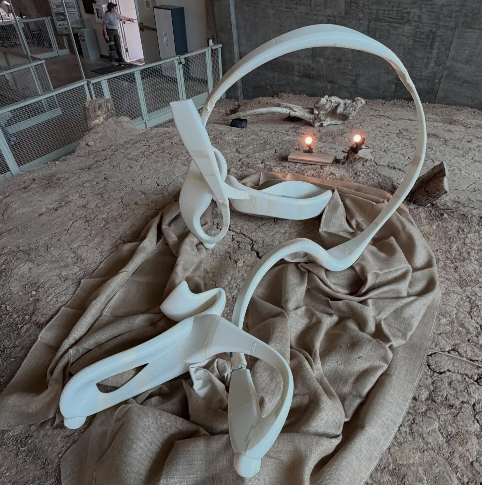
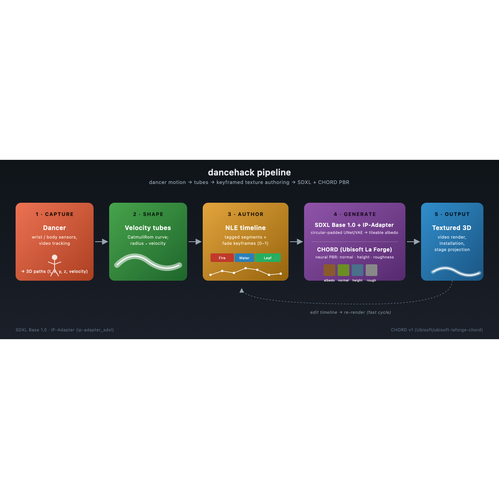
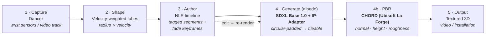

# dancehack

Texture-painting timeline for dancer motion. Take 3D paths captured from a dancer (e.g. wrist/hand sensor data), render them as tubes whose width follows velocity, and paint generated textures onto them along an NLE-style timeline.


## Context

Built under interdisciplinary artist **[Merli Guerra](https://www.instagram.com/merliguerra/)**, whose practice spans choreography, video, and visual installation. dancehack is a custom tool for translating recorded dancer movement into texturable 3D geometry that can be re-animated and re-skinned for video work and installations — the dancer's path becomes a brushstroke; the timeline picks what it's painted with.

| Studio / performance reference |   |
|---|---|
|  |  |

Motion reference (clip): [`docs/media/merli-performance.mp4`](docs/media/merli-performance.mp4) — the kind of movement whose captured path becomes the input to this tool.

## Pipeline





1. **Capture.** A dancer's motion is recorded as 3D paths (`t, x, y, z, velocity`) — wrist/body sensors or video tracking.
2. **Shape.** Each path becomes a 3D tube; tube radius is driven by velocity, so the geometry already encodes the energy of the movement.
3. **Author.** Drop tagged segments on a familiar NLE-style timeline (think After Effects / Premiere) and shape the look over time with fade keyframes per track.
4. **Generate.** Each tag's texture is produced by a local Python service:
   - **Albedo / color:** [Stable Diffusion XL Base 1.0](https://huggingface.co/stabilityai/stable-diffusion-xl-base-1.0) with **circular padding on the UNet + VAE** for seam-free horizontal tiling, conditioned by **[IP-Adapter for SDXL](https://huggingface.co/h94/IP-Adapter)** (`ip-adapter_sdxl.bin`) when a reference image is supplied alongside the text prompt.
   - **PBR maps:** **[CHORD](https://huggingface.co/Ubisoft/ubisoft-laforge-chord)** (Ubisoft La Forge) for neural material estimation — normal → height/displacement and roughness.
5. **Output.** Textured tubes are rendered for video work, installation, or stage projection.

The authoring loop is fast: edit the timeline, hit Gen, swap a tag — the keyframe surface is the artist-facing affordance; the diffusion + PBR stack stays under the hood.

## What it does

- **3D viewport** — Each input path becomes a tube in 3D. Tube radius is driven by per-point velocity, so faster motion = thicker tube. Orbit/pan to inspect.
- **Timeline (NLE)** — One track per path. Drop tagged **segments** onto a track to assign a texture to a time range. Each segment shows a thumbnail of its tag's texture so the whole track reads as a strip.
- **Keyframe lane** — Below each segment row, a per-track curve of fade keyframes (0–1) drives displacement / opacity over time. Click to select, double-click to retag or add a lane.
- **Tag library** — Named tags (Fire, Leaf, Water, Lizard Skin, …) each carry a texture. The **Gen** button per tag runs SDXL Base 1.0 + IP-Adapter (text prompt + optional reference image) with circular padding for a tileable albedo, then CHORD for normal + height + roughness maps. Diffusion progress is shown inline (e.g. `Step 0/30`).
- **Dancer video** — Drop a video file (or set a URL) into the top-left panel to scrub the dancer footage alongside the 3D scene and timeline.
- **Global controls** — `Tex ON/OFF`, `Disp` (displacement), `Density`, `Compress` sliders affect how textures are applied to the tubes.

## Input

The app consumes **path data**, not raw meshes: ordered 3D points with time (`{ t, x, y, z, velocity? }`). If you only have a mesh, you need a mesh→paths step first. See `texture-generator/HANDOFF.md §5`.

## Repo layout

```
dancehack/
├── texture-generator/      # The app (frontend + planned Python generator)
│   ├── frontend/           # React + Vite + TypeScript + react-three-fiber
│   ├── generator/          # FastAPI texture service (planned)
│   ├── README.md           # Run instructions
│   └── HANDOFF.md          # Full architecture / data model / state of work
└── workflows/              # ComfyUI workflows: video → PLY, batch images → PLY
```

## Run

```bash
cd texture-generator/frontend
npm install
npm run dev
```

Open the dev URL printed by Vite (typically http://localhost:5173).

## Data model (short)

| Type | Shape |
|------|-------|
| Path | `{ id, name, points: PathPoint[] }` |
| PathPoint | `{ t, x, y, z, velocity? }` |
| Segment | `{ id, trackId, start, end, tagId }` |
| Tag | `{ id, label, textureId?, textureUrl? }` |
| Keyframe | `{ id, trackId, time, value }` (0–1) |

Full reference: [`texture-generator/HANDOFF.md`](texture-generator/HANDOFF.md).
