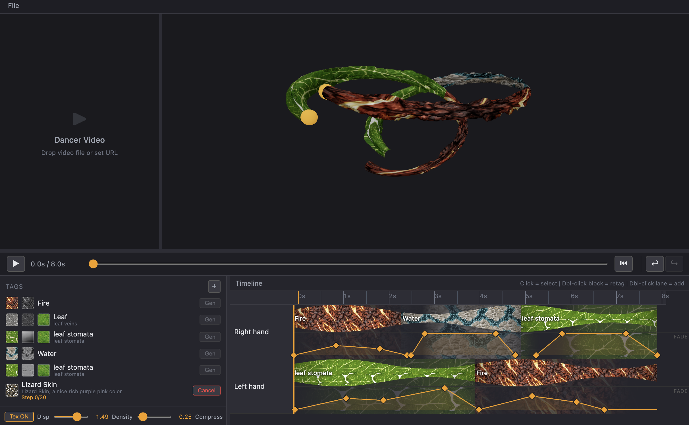

# dancehack

Texture-painting timeline for dancer motion. Take 3D paths captured from a dancer (e.g. wrist/hand sensor data), render them as tubes whose width follows velocity, and paint generated textures onto them along an NLE-style timeline.



## What it does

- **3D viewport** — Each input path becomes a tube in 3D. Tube radius is driven by per-point velocity, so faster motion = thicker tube. Orbit/pan to inspect.
- **Timeline (NLE)** — One track per path. Drop tagged **segments** onto a track to assign a texture to a time range. Each segment shows a thumbnail of its tag's texture so the whole track reads as a strip.
- **Keyframe lane** — Below each segment row, a per-track curve of fade keyframes (0–1) drives displacement / opacity over time. Click to select, double-click to retag or add a lane.
- **Tag library** — Named tags (Fire, Leaf, Water, Lizard Skin, …) each carry a texture. The **Gen** button per tag triggers texture generation from a text prompt + optional IP-Adapter reference, producing a tileable texture for that tag (progress shown inline, e.g. `Step 0/30`).
- **Dancer video** — Drop a video file (or set a URL) into the top-left panel to scrub the dancer footage alongside the 3D scene and timeline.
- **Global controls** — `Tex ON/OFF`, `Disp` (displacement), `Density`, `Compress` sliders affect how textures are applied to the tubes.

## Input

The app consumes **path data**, not raw meshes: ordered 3D points with time (`{ t, x, y, z, velocity? }`). If you only have a mesh, you need a mesh→paths step first. See `texture-generator/HANDOFF.md §5`.

## Repo layout

```
dancehack/
├── texture-generator/      # The app (frontend + planned Python generator)
│   ├── frontend/           # React + Vite + TypeScript + react-three-fiber
│   ├── generator/          # FastAPI texture service (planned)
│   ├── README.md           # Run instructions
│   └── HANDOFF.md          # Full architecture / data model / state of work
└── workflows/              # ComfyUI workflows: video → PLY, batch images → PLY
```

## Run

```bash
cd texture-generator/frontend
npm install
npm run dev
```

Open the dev URL printed by Vite (typically http://localhost:5173).

## Data model (short)

| Type | Shape |
|------|-------|
| Path | `{ id, name, points: PathPoint[] }` |
| PathPoint | `{ t, x, y, z, velocity? }` |
| Segment | `{ id, trackId, start, end, tagId }` |
| Tag | `{ id, label, textureId?, textureUrl? }` |
| Keyframe | `{ id, trackId, time, value }` (0–1) |

Full reference: [`texture-generator/HANDOFF.md`](texture-generator/HANDOFF.md).
